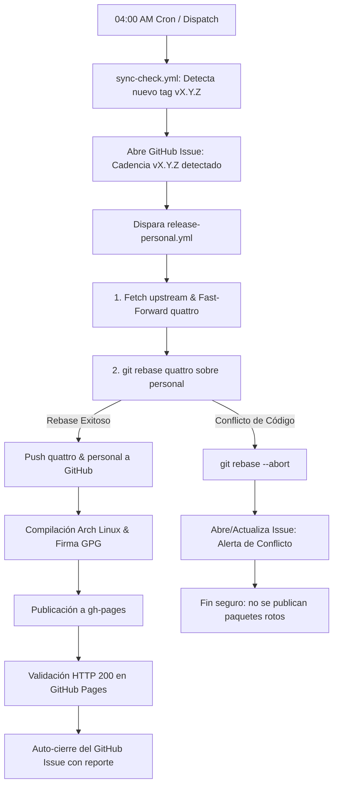

# 05 — Mantener (para el mantenedor)

Dos rutinas que hacen que el sistema personal "respire": **añadir un paquete personal** y **seguir
las versiones de Omarchy upstream**. Ambas terminan igual: publicar con la Action y actualizar las
máquinas.

> Regla de oro del versionado del par `omarchy`/`omarchy-settings`:
> **mismo `pkgver` que el upstream base, `pkgrel` siempre alto y creciente** (99, 100, 101…).
> Eso garantiza que tus versiones le ganen a las oficiales y `omarchy update` nunca baje al par
> oficial (que no tendría tus personalizaciones).
> Desde 2026-09-01 la Action **deriva el `pkgrel` sola** (§5.3 del plan): pkgver nuevo → 99;
> mismo pkgver → última republicación +1. Tú solo pasas la `version`.

## Añadir un paquete personal nuevo

Un paquete tuyo, con tus archivos, publicado por el mismo repositorio. Ejemplo real ya funcionando:
`hola-mundo` (un script que imprime un mensaje).

Estructura de un paquete (en `omarchy-pkgs`):

```
pkgbuilds/hola-mundo/
├── PKGBUILD
└── .omarchy/
    └── package.json
```

Pasos:

```bash
cd ~/Work/omarchy/omarchy-pkgs
mkdir pkgbuilds/mi-paquete
# 1) Escribe pkgbuilds/mi-paquete/PKGBUILD (receta de package de Arch normal)
# 2) Mark como "personal":
#    pkgbuilds/mi-paquete/.omarchy/package.json →
#      { "source": "local", "release_ring": "fast", "personal": true }
git add pkgbuilds/mi-paquete
git commit -m "personal: add mi-paquete"
git push origin personal
```

```bash
# 3) Publicar (el pkgrel del par lo deriva sola la Action; SIEMPRE --ref personal)
gh workflow run release-personal.yml -R robert-flo/omarchy-pkgs \
  --ref personal -f version=v4.0.2
```

```bash
# 4) En cada máquina donde quieras el paquete: instalarlo UNA vez
sudo pacman -S mi-paquete
```

De ahí en adelante `omarchy update` lo mantiene. Si el paquete debe estar en TODAS las máquinas
desde cero, añádelo también a `install/omarchy-base.packages` del fork fuente.

Detalles prácticos de un PKGBUILD personal (lo visto con `hola-mundo`):

- `arch=('any')` si no compila nada; `sha256sums=('SKIP')` si el source es local.
- No necesita lockstep ni tag: eso es solo del par `omarchy`/`omarchy-settings` (lo gestiona el
  propio proceso de publicación).
- El `pkgrel` de un paquete genérico es el normal que escribas en su PKGBUILD (la regla 99+ crece
  solo se aplica al par).

## Publicar un cambio (la orden que se repite)

Cada vez que hagas un cambio de fuente (webapp, config, tema, comando, paquete), publica y actualiza:

```bash
# Publicar (en ~/Work/omarchy/omarchy-pkgs, rama personal; SIEMPRE --ref personal;
# el pkgrel del par se deriva solo)
gh workflow run release-personal.yml -R robert-flo/omarchy-pkgs \
  --ref personal -f version=v4.0.2

# Esperar a que termine (unos minutos) y verificar la publicación:
gh run watch --exit-status
# …y en las máquinas:
omarchy update
```

## Seguir el release de Omarchy upstream (Cadencia Automática & Manual)

Cuando Omarchy upstream (`omacom/omarchy`) publica una versión nueva (`vX.Y.Z`), el sistema cuenta con un **pipeline automatizado de cadencia a las 04:00 AM** que detecta el tag, sincroniza la rama `quattro`, rebasea `personal`, compila los paquetes y los publica sin requerir intervención manual.

### Arquitectura del Pipeline de Sincronización



### 1. Flujo Desatendido Diario (Zero-Touch a las 04:00 AM)
1. **Detección (`sync-check.yml`):**
   - Compara el último tag de release en `omacom/omarchy` contra los paquetes en `omarchy-personal-repo`.
   - Si detecta un tag nuevo, abre un GitHub Issue de seguimiento y dispara `release-personal.yml`.
2. **Sincronización y Rebase (`release-personal.yml`):**
   - Usa la deploy key `SSH_OMARCHY_SOURCE_KEY` para autenticación con permisos de escritura sobre `robert-flo/omarchy`.
   - Hace Fast-Forward de `quattro` directo a `upstream/quattro`.
   - Ejecuta `git rebase quattro` sobre la rama `personal`.
   - Si no hay conflictos, hace push de `quattro` y `personal` a GitHub, compila con Docker, firma con GPG y publica en GitHub Pages.
   - Valida el HTTP 200 de los metadatos y **cierra automáticamente el GitHub Issue** con el reporte de entrega.
3. **Escudo ante Conflictos:**
   - Si upstream modifica una línea que colisiona con las personalizaciones del fork, el workflow detecta el conflicto, ejecuta `git rebase --abort`, aborta la compilación para evitar publicar software roto, y publica un GitHub Issue de alerta con la lista de archivos afectados e instrucciones exactas de resolución local.

### 2. Flujo Manual (Si deseas adelantar la sincronización o resolver conflictos)

Si deseas sincronizar manualmente en cualquier momento desde tu terminal local:

```bash
cd ~/Work/omarchy/omarchy-installer  # o directorio robert-flo_omarchy-personal
git fetch upstream
git checkout -B quattro upstream/quattro
git push origin quattro
git checkout personal
git rebase quattro
git push --force-with-lease origin personal
```

Y luego disparar la publicación de paquetes:

```bash
# En omarchy-pkgs: publicar con el pkgver del tag nuevo (el pkgrel se
# deriva solo: pkgver nuevo → base 99, por encima del oficial)
gh workflow run release-personal.yml -R robert-flo/omarchy-pkgs \
  --ref personal -f version=vX.Y.Z
```

…y en cada máquina al despertar o trabajar:
```bash
omarchy update
```

### Qué hacer si hay conflictos en el rebase

Si el bot abrió un issue de alerta `[Conflicto Rebase]`:
1. Ve al directorio local de `omarchy` (`robert-flo_omarchy-personal`).
2. Ejecuta `git fetch upstream && git checkout personal && git rebase upstream/quattro`.
3. Abre los archivos marcados con conflicto, ajusta las diferencias preservando las personalizaciones deseadas.
4. Ejecuta `git add <archivos-resueltos>` y `git rebase --continue`.
5. Haz push forzado seguro: `git push --force-with-lease origin personal`.
6. Cierra el GitHub Issue y dispara `release-personal.yml` con `gh workflow run`.

### Verificación mínima tras publicar

```bash
# La db del repo personal debe listar las versiones nuevas:
curl -s https://robert-flo.github.io/omarchy-personal-repo/stable/x86_64/omarchy.db.tar.zst | bsdtar -xOf - omarchy/desc
# En una máquina:
pacman -Q omarchy omarchy-settings
```

## Checklist rápida de la cadencia (tras un release upstream)

1. [ ] `git fetch upstream` + rebase (sin conflictos, o resueltos).
2. [ ] `./test/all` pasa (salvo tests ambientales).
3. [ ] `git push --force-with-lease origin personal` + tag sync.
4. [ ] Dispatch de la Action **con `--ref personal`** y el pkgver del tag nuevo (pkgrel autoderivado); el run acaba verde.
5. [ ] `omarchy update` en cada máquina llega a la versión personal nueva.